<!-- @author kongweiguang -->

<div align="center">
  
  <h1>Kerminal</h1>
  <p><strong>把终端、远程服务器、文件传输、容器运维与 AI Agent 放进同一个桌面工作台。</strong></p>
  <p>
    <a href="https://github.com/kongweiguang/kerminal/releases/latest">下载最新版</a>
    ·
    <a href="#快速开始">快速开始</a>
    ·
    <a href="#当前能力">当前能力</a>
    ·
    <a href="#源码开发">源码开发</a>
  </p>
  <p><sub>当前稳定版 v0.3.29 · Tauri 2 · Windows / Linux / macOS</sub></p>
</div>

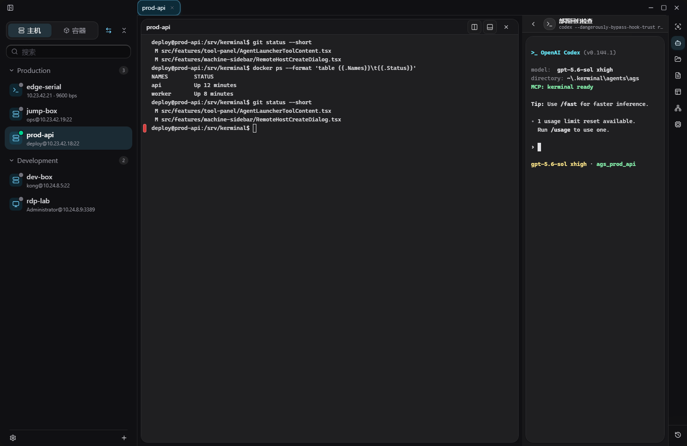

Kerminal 是一个本地优先的桌面终端和远程运维工作台。它围绕“当前目标”组织本机与远程终端、SFTP、Docker/Podman、Compose、tmux、SSH 隧道、服务器监控和 Agent 会话，让开发、排障和交付不必在多个窗口之间反复切换。

内置 Agent Launcher 支持 Codex、Claude、PI Agent 和可持久化的自定义 CLI。每个 Agent 会话都有独立工作目录和明确的 `tab` / `global` 权限范围，并可通过 Kerminal MCP 使用正在运行的终端与远程能力。

> README 截图使用固定的脱敏演示数据生成，不包含真实主机、凭据或用户会话。

## 当前能力

| 领域 | 当前已实现能力 |
| --- | --- |
| 连接 | Local、SSH、独立 SFTP、RDP、Telnet、Serial；SSH 支持密码、私钥、SSH Agent、代理、跳板机和多跳。 |
| 终端工作区 | 多 Tab、多 Pane、横向/纵向分屏、拖拽调整、批量发送、命令块、搜索、日志、自动重连、命令建议和 URL Ctrl/Command 点击。 |
| 文件与传输 | SFTP 文件浏览、双面板传输、队列与进度、取消/重试、断点续传、冲突策略、远程预览与文本编辑。 |
| 容器 | 在 SSH 主机上管理 Docker、Podman 与 Compose，查看容器、镜像、服务、日志和状态，进入终端并操作容器内文件。 |
| 远程工具 | SSH 本地/远程/SOCKS 隧道、tmux 会话、CPU/内存/磁盘/网络/GPU/NPU/进程信息和命令历史。 |
| Agent | Codex、Claude、PI Agent、自定义 CLI；会话恢复、重命名、归档、发送预览、排队提示，以及 Tab/Global scope。 |
| MCP | 本机 loopback Streamable HTTP；提供终端、SSH/SFTP、容器与容器文件、tmux、端口转发、服务器信息、历史和诊断等运行态工具。 |
| 配置与安全 | `~/.kerminal` 文件化配置、加密凭据库、配置校验、Workspace Sync、主题/壁纸/透明度、快捷键与自动更新。 |

## 下载与安装

前往 [GitHub Releases](https://github.com/kongweiguang/kerminal/releases/latest) 获取当前稳定版。v0.3.29 已公开提供以下产物：

| 平台 | 发布产物 |
| --- | --- |
| Windows x64 | NSIS 安装程序 |
| Linux x64 | AppImage、Deb |
| macOS Apple Silicon | App、DMG |
| macOS Intel | App、DMG |

macOS 产物目前没有 Apple Developer ID 签名和公证。如果确认应用来自本仓库 Releases，但仍被 Gatekeeper 阻止，可在将应用拖入“应用程序”后运行：

```bash
sudo xattr -rd com.apple.quarantine /Applications/Kerminal.app
```

该命令只移除 Kerminal 的隔离标记，不会全局关闭 Gatekeeper。

## 快速开始

### 1. 添加连接

点击左下角的添加按钮，选择连接类型并填写目标信息。

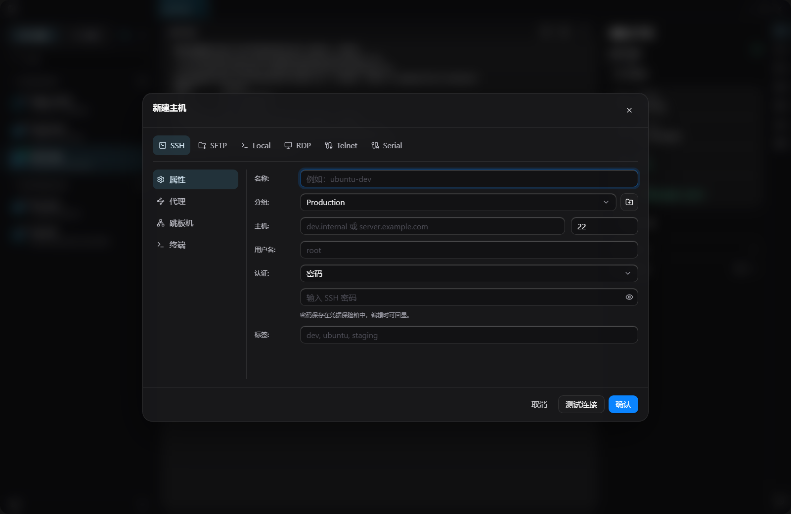

- SSH 可组合密码、私钥、SSH Agent、代理和跳板机；密码与私钥口令进入本地加密凭据库。
- 独立 SFTP 目标只提供文件能力，不会获得 shell、tmux、容器、监控或端口转发能力。
- RDP 会生成并交给系统 RDP 客户端打开；Telnet 与 Serial 依赖本机可用的对应客户端。

### 2. 打开终端并确认当前目标

选择主机即可创建终端。一个 Tab 可以拆成多个 Pane，并在同一任务内混合不同目标；批量发送前可以显式选择 Pane，避免命令发错机器。

“当前上下文”集中显示主机、目录、连接状态、工作区详情和 Agent 状态，适合在多服务器、多分屏和多会话之间确认目标。

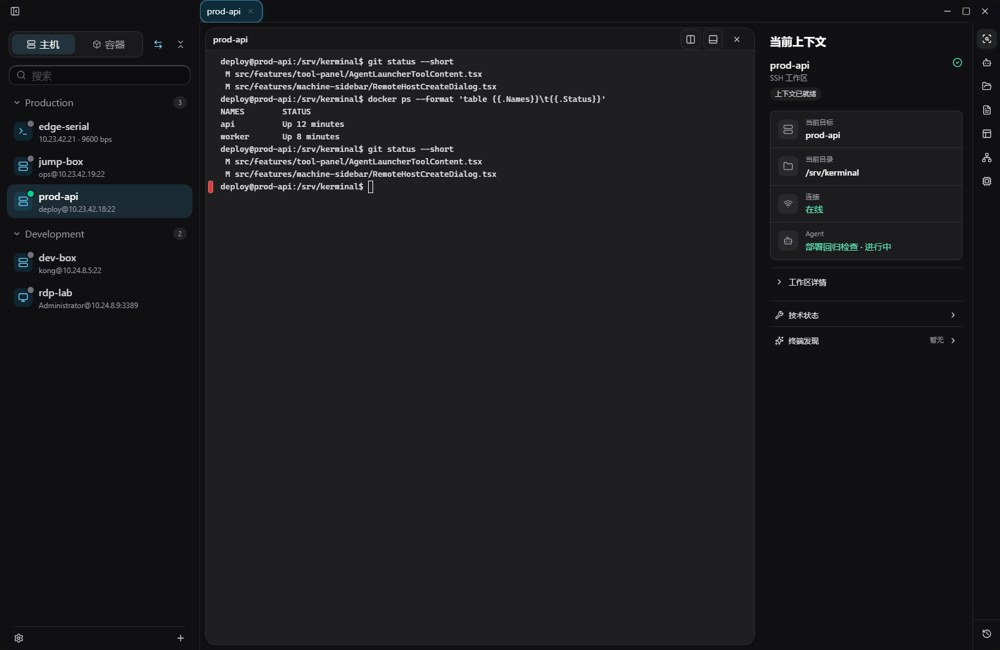

### 3. 启动 Agent

打开右侧 Agent 工具，从统一选择器中选择 Codex、Claude、PI Agent 或已保存的自定义 Agent，然后点击“进入”。

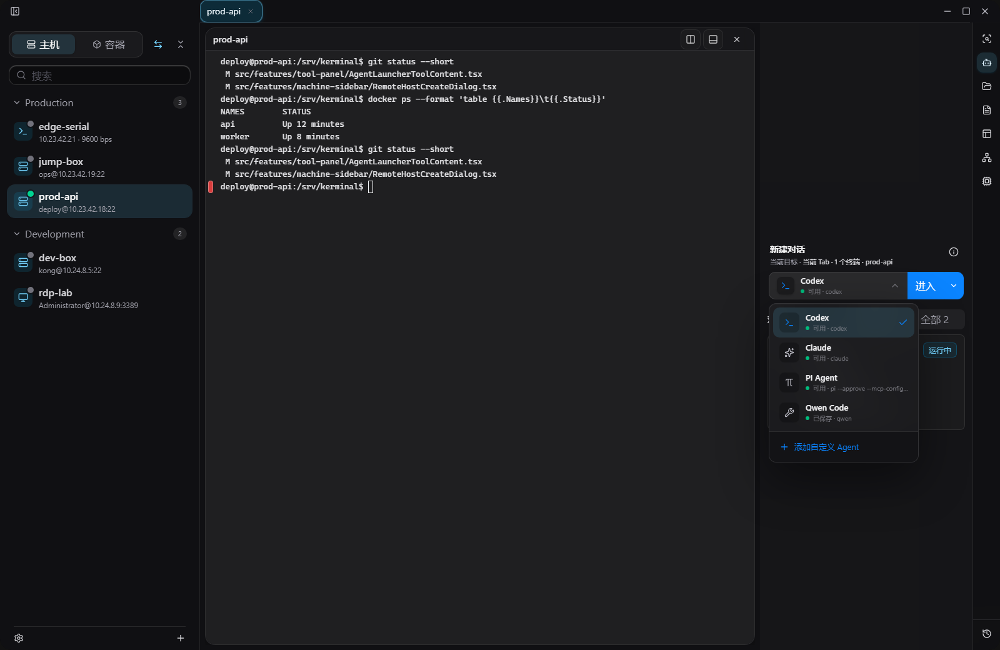

| Agent | 本机前置条件 |
| --- | --- |
| Codex | 已安装 `codex` CLI，并完成账号登录。 |
| Claude | 已安装 `claude` CLI，并完成账号登录。 |
| PI Agent | 已安装 PI CLI 和 `pi-mcp-adapter`，且 Kerminal 探测通过。 |
| 自定义 Agent | 在选择器中保存可执行命令；命令会以明文写入 `settings.toml`，不要放密码、API Key 或 token。 |

首次进入会创建独立会话；如果当前 scope 已有历史会话，可以继续上次或新建会话。

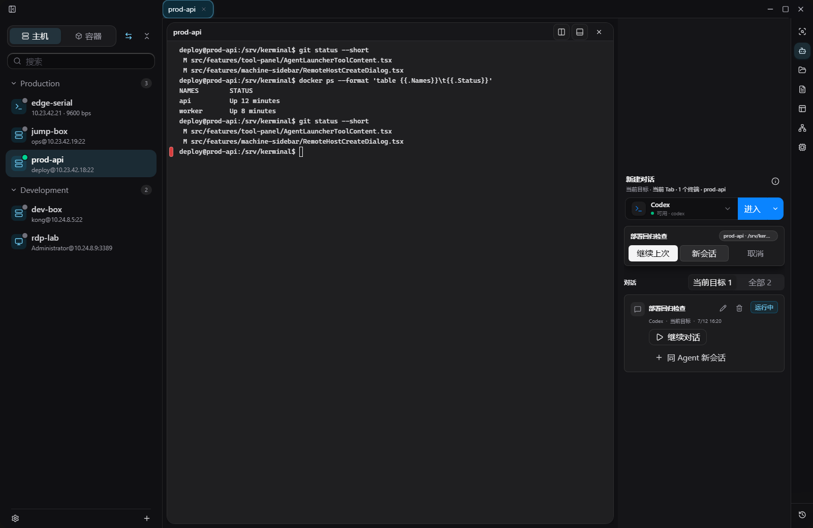

Agent 默认使用当前 Tab scope：自动包含该 Tab 的全部用户终端 Pane，以及之后新建的 Pane。显式选择全局模式后，scope 才会覆盖所有工作区 Tab；右栏 Agent 自己的 TUI 始终排除在用户终端 scope 之外。

### 4. 使用右侧工具

右侧工具跟随当前主机、Tab 或 Pane，提供当前上下文、Agent、文件、片段、tmux、端口、系统信息和命令历史。右击工具栏或按 `Shift+F10` 可调整显示、顺序、底部分组与面板位置；布局会持久化到本地设置。

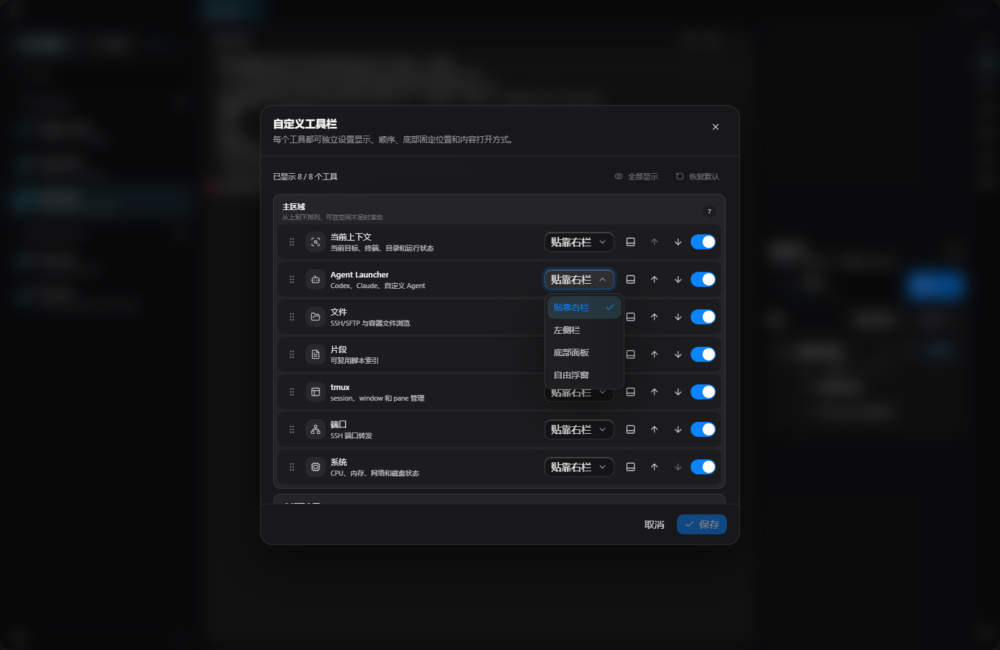

## 终端与工作区

- 本机、SSH、Telnet、Serial 与容器交互终端统一使用 xterm 工作区。
- 支持多标签、多级分屏、拖拽调整、输出搜索、命令块复制和多 Pane 批量发送。
- 命令建议可组合命令、参数、路径、历史和 Git 引用，并对生产主机使用更严格策略。
- 普通点击终端 URL 仍用于选择文本；Windows/Linux 按住 `Ctrl`、macOS 按住 `Command` 才会交给外部浏览器打开。
- GPU 渲染不可用或异常时可回退到兼容渲染路径；渲染模式、字体、主题、字号、行高和交互行为都可独立配置。

## Agent 会话与 Kerminal MCP

Kerminal 为每个 Agent 创建 `~/.kerminal/agents/sessions/<agentSessionId>`，保存会话 scope、目标绑定、终端快照和启动信息。历史会话可以继续、同 Agent 新建、重命名、归档或删除本地记录；终端断开后，Agent 可通过运行态工具重新发现并恢复连接。

Agent 发送链路支持当前上下文、终端选区和命令块预览。内容在真正发送前可检查；过长内容会受限并脱敏，Agent 忙碌时可以排队后续提示。

Kerminal MCP 只监听本机回环地址，提供全局入口与 Agent session 入口。常用发现顺序是：

1. `kerminal.app_guide` / `kerminal.capabilities` 了解应用入口和工具族。
2. `kerminal.agent.current_session` / `kerminal.agent.target_context` 刷新当前会话与 scope。
3. `terminal.list` 获取允许操作的用户终端，再使用显式 ID 调用 snapshot、write 或 reconnect。
4. 按需使用 SFTP、容器文件、tmux、端口转发、服务器信息、历史或诊断工具。

工具确认、审批、权限和审计由 Codex、Claude 等 MCP host 负责。设置、Profile、主机、片段和工作流配置不通过 MCP CRUD 管理；Agent 应直接编辑工作区文件并运行 validator。

## SFTP、传输与远程编辑

SFTP 既可以停靠在右侧作为文件浏览器，也可以打开为中央双面板传输工作台。

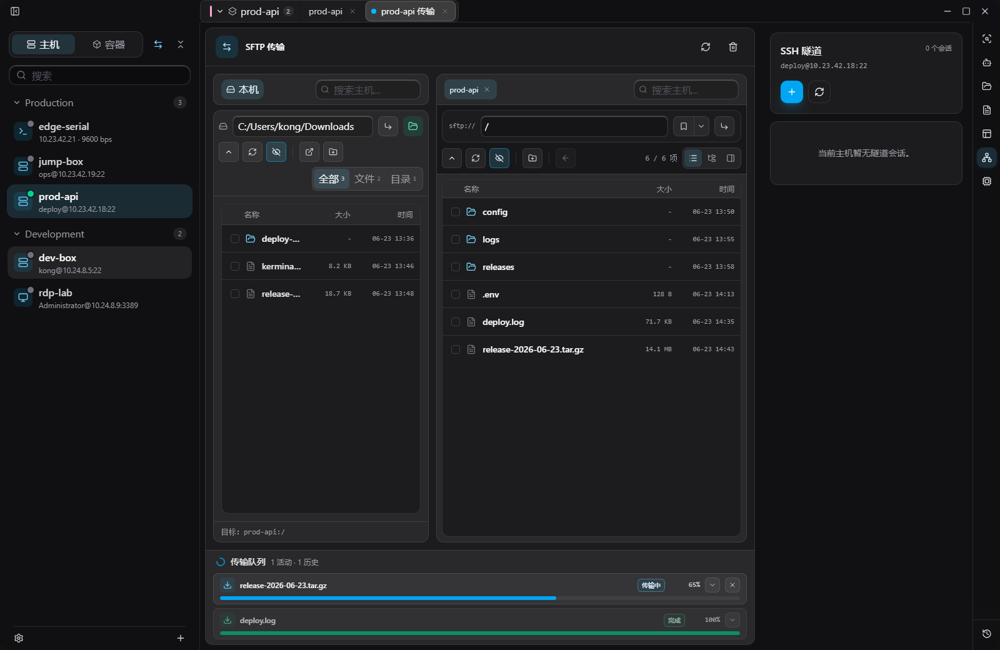

- 上传、下载、目录传输、远端复制和跨主机传输。
- 队列、实时进度、取消、失败重试、断点续传、完成历史和冲突策略。
- 列表、树形和工作区模式，支持隐藏文件、路径书签和终端目录跟随。
- 远程文件预览与文本编辑；保存时校验 revision，避免静默覆盖远端并发修改。

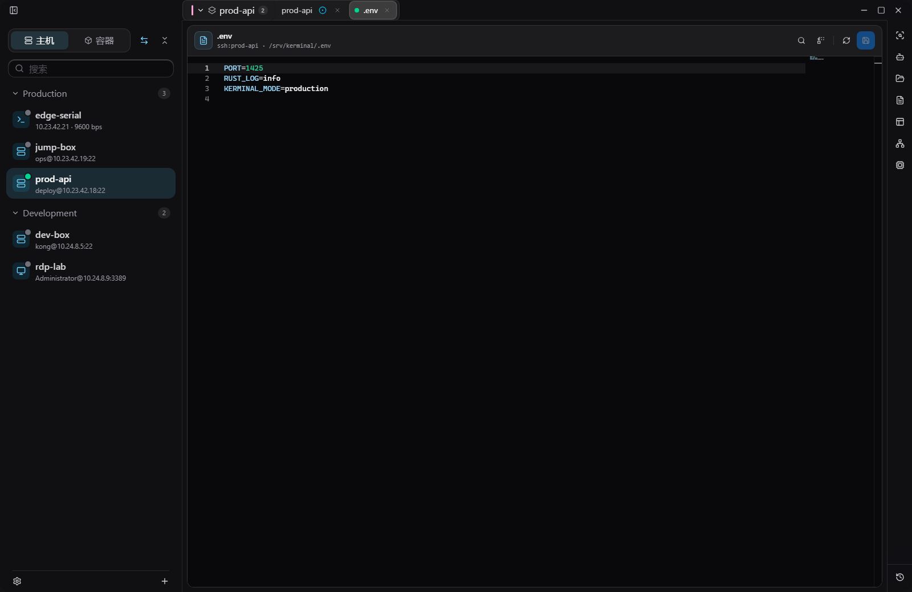

## 容器与 Compose

连接 SSH 主机后，可以切换左栏到容器视图，按运行时和 Compose 应用组织 Docker/Podman 资源。

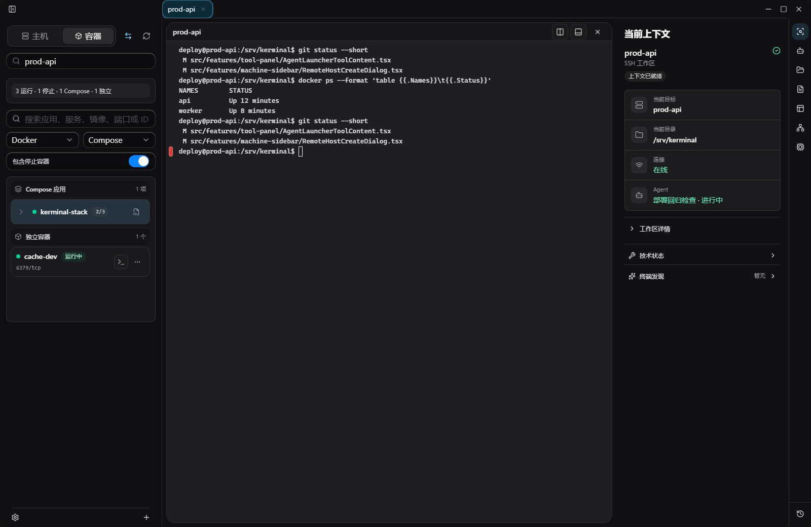

- 查看容器、镜像、Compose 服务、端口、状态和详情。
- 启动、停止、重启或删除容器，打开日志、stats 和交互终端。
- 浏览、预览、写入、上传、下载、创建、重命名、改权限和删除容器内文件。
- 容器管理依赖 SSH 宿主；独立 SFTP、RDP、Telnet 和 Serial 目标不提供该能力。

## 服务器信息、SSH 隧道与 tmux

系统工具提供“概览、资源、进程”视图，可手动刷新或按间隔采样。

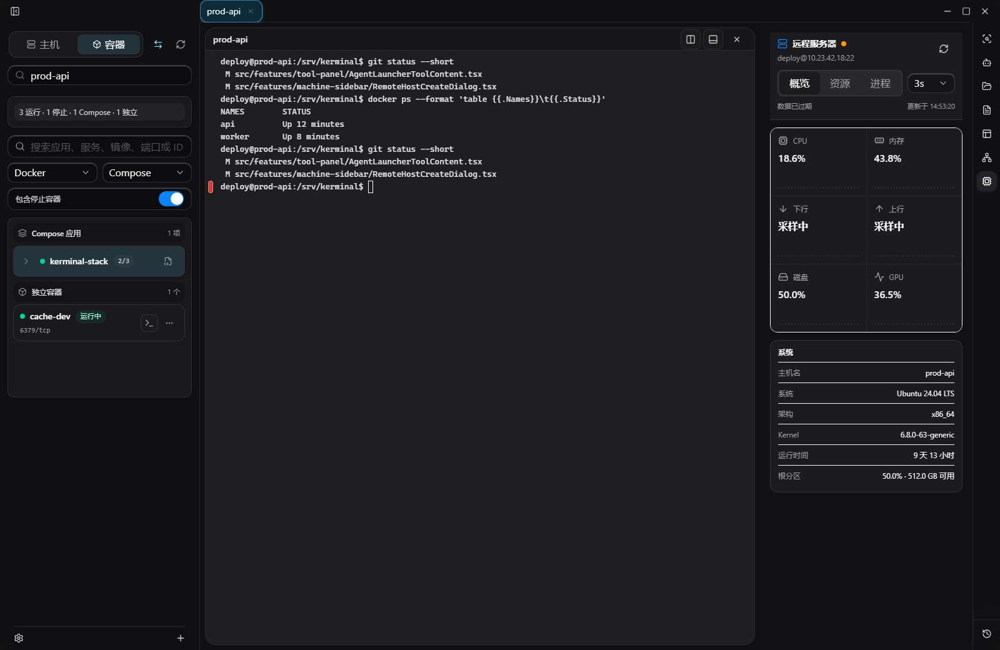

CPU、内存、磁盘、网络、系统、架构、Kernel、运行时间和进程信息为基础能力。GPU/NPU 指标只会在目标机存在并允许执行 `nvidia-smi`、`npu-smi` 等探测工具时出现；这里是运维观察面板，不是长期指标存储系统。

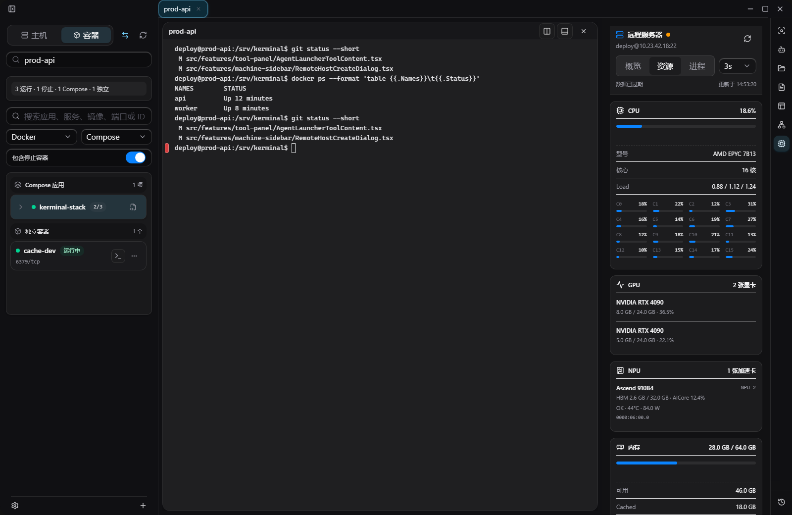

SSH 隧道把常用场景直接映射为 OpenSSH `-L`、`-R` 与 SOCKS，支持本地动态和远端动态代理、绑定范围、保存后启动/停止，以及向当前终端注入临时代理环境。

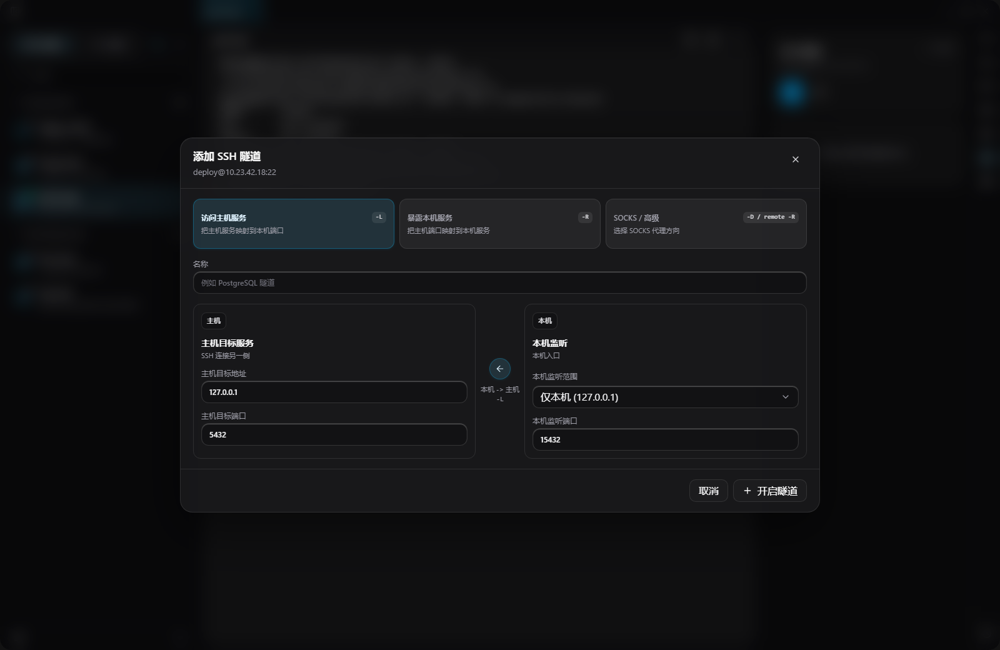

tmux 工具可在 Local/SSH 目标上查看、创建、连接、重命名、分离和关闭会话，并提供常用命令入口。

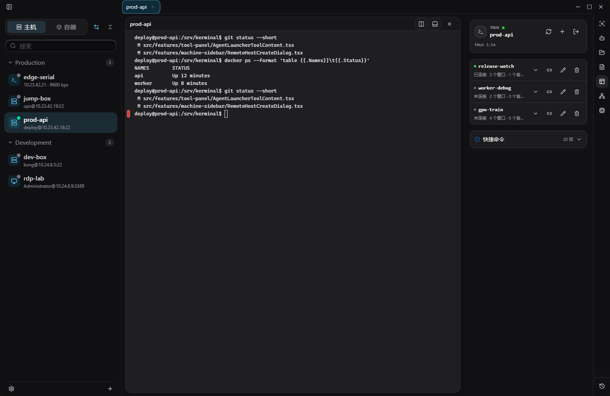

## 外部 SSH 启动

Kerminal 可以接收并解析来自 PuTTY、MobaXterm、Xshell、SecureCRT、OpenSSH、URL 或命令行参数的 SSH/SFTP 启动请求。该能力表示 Kerminal 对这些来源格式的接入，不代表第三方厂商官方集成。

Windows 可由用户显式注册 `kerminal://` 系统协议；外部请求进入后仍会经过参数校验、主机身份检查和必要的安全确认，传入的密码与私钥口令只用于当前会话，不写入连接配置。

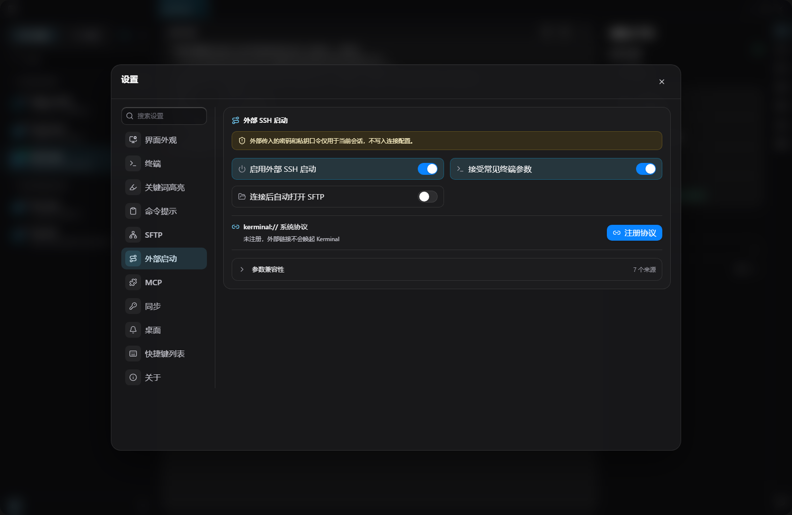

## 设置与配置工作区

设置页覆盖界面外观、终端、关键词高亮、命令提示、SFTP、外部启动、MCP、配置同步、桌面通知、快捷键和自动更新。界面支持浅色、深色和跟随系统主题，也可配置壁纸、窗口透明度与终端配色。

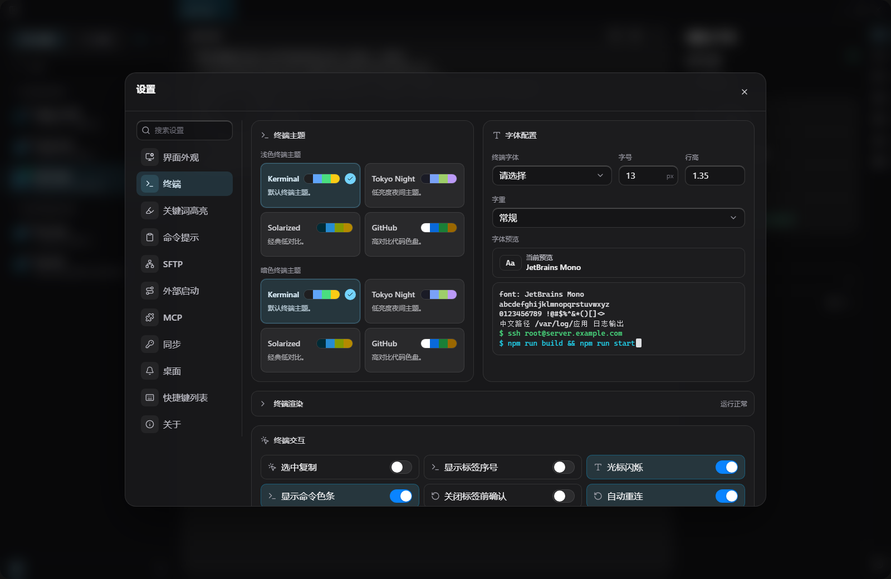

长期配置位于 `~/.kerminal`：

```text
settings.toml
profiles/*.toml
hosts/groups.toml
hosts/*.toml
snippets/*.toml
workflows/*.toml
```

配置规则由工作区生成的 `kerminal-config.md` 和 MCP `kerminal.config_guide` 提供。主机 TOML 只保存 `secret_ref`、`key_passphrase_ref` 等 vault 引用，禁止写入密码、私钥正文或私钥口令。Workspace Sync 只同步可移植配置，并排除 vault key、备份和事务恢复文件等本机私有数据。

## 数据与安全边界

- 主机、布局、传输记录、历史和 Agent 会话默认保存在本机。
- 密码、私钥口令等敏感信息进入本地加密凭据库；普通配置只保存引用。
- 向 Agent 发送终端内容前提供预览；删除本地 Agent 记录不会删除服务商侧历史。
- MCP 只提供必须依赖正在运行应用、既有终端或远程连接的能力，不接管 host 的审批与审计策略。
- 覆盖、删除、停止、信任未知 host key 等有副作用操作使用对应的确认边界。
- 浏览器预览模式只用于前端开发，不能证明本地命令、SSH/SFTP、容器、隧道、系统协议或真实 Agent 已可用；完整能力必须在 Tauri 桌面运行时验证。

## 源码开发

准备 Node.js 20+、Rust stable 和对应平台的 Tauri 依赖。仓库使用 `pnpm@10.33.0`：

```powershell
corepack enable
pnpm install --frozen-lockfile
pnpm run tauri:dev
```

常用验证命令：

```powershell
pnpm run build
pnpm run check
```

`pnpm run dev` 只启动浏览器前端预览。维护 README 截图时，先启动固定端口的前端，再运行脱敏场景采集：

```powershell
pnpm run dev -- --host 127.0.0.1 --port 1425
pnpm run docs:capture-readme-screenshots -- http://127.0.0.1:1425/
```

## 开源协议

Kerminal 以 GNU General Public License v3.0 or later（GPL-3.0-or-later）授权，详见 [LICENSE](LICENSE)。
